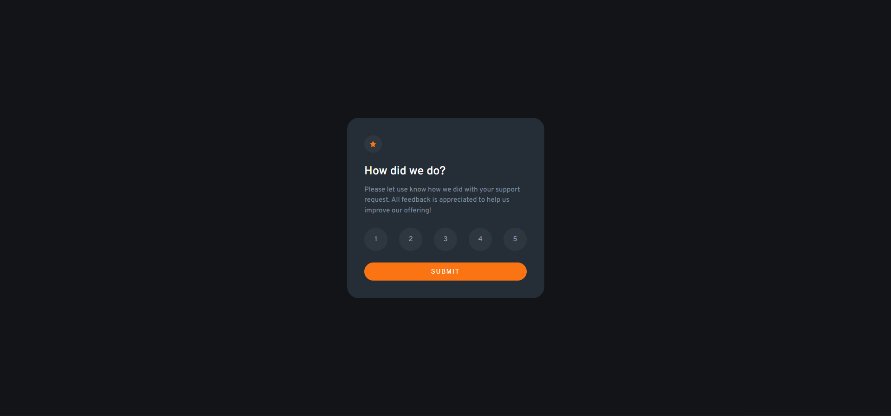
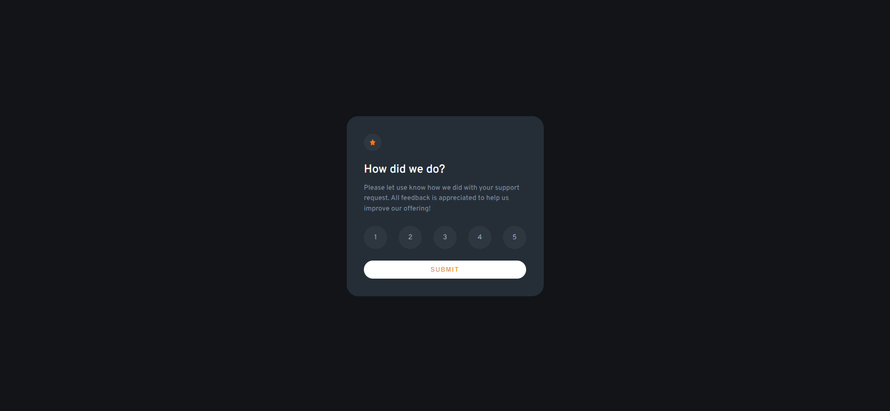
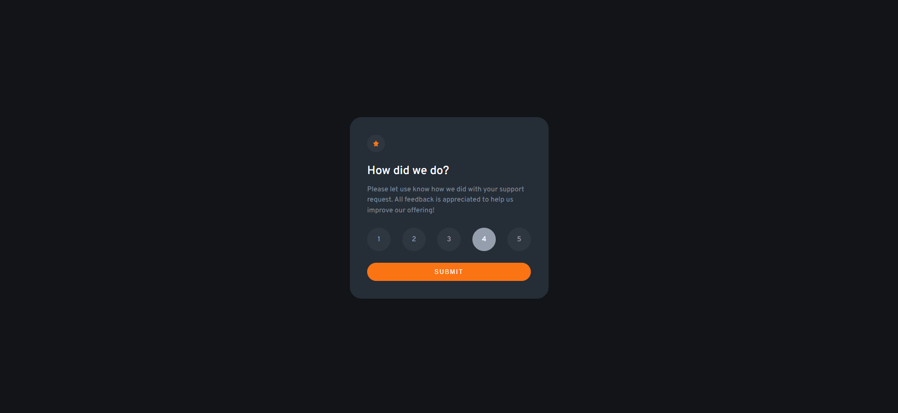
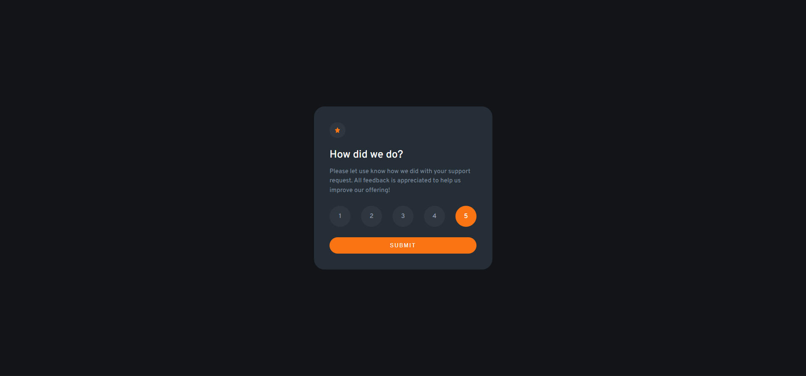
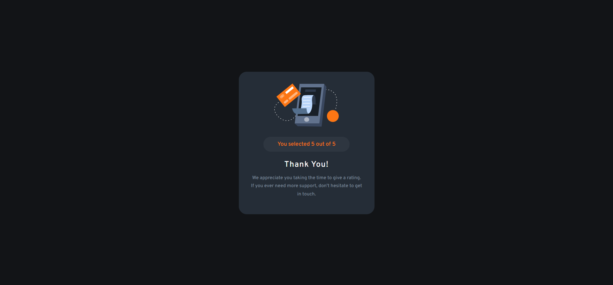

# Frontend Mentor - Interactive rating component solution

This is a solution to the [Interactive rating component challenge on Frontend Mentor](https://www.frontendmentor.io/challenges/interactive-rating-component-koxpeBUmI).

## Table of contents

- [Overview](#overview)
  - [The challenge](#the-challenge)
  - [Screenshot](#screenshot)
  - [Links](#links)
- [My process](#my-process)
  - [Built with](#built-with)
- [Author](#author)

## Overview

### The challenge

Users should be able to:

- View the optimal layout for the app depending on their device's screen size
- See hover states for all interactive elements on the page
- Select and submit a number rating
- See the "Thank you" card state after submitting a rating

### Screenshot

### Links

- Solution URL: [Interactive Rating App - Github URL](https://github.com/MouhsineNejmi/interactive-rating-app)
- Live Site URL: [Interactive Rating App - Live URL](https://interactive-rating-app-murex.vercel.app/)

## My process

### Built with

- [React](https://reactjs.org/) - JS library
- CSS

## Author

- My Name is Mouhsine NEJMI and I'm a Frontend Developer. I love coding and to challenge myself to solve coding problems.
- Mail - [nejmi.mouhcine10@gmail.com](mailto:nejmi.mouhcine10@gmail.com)
